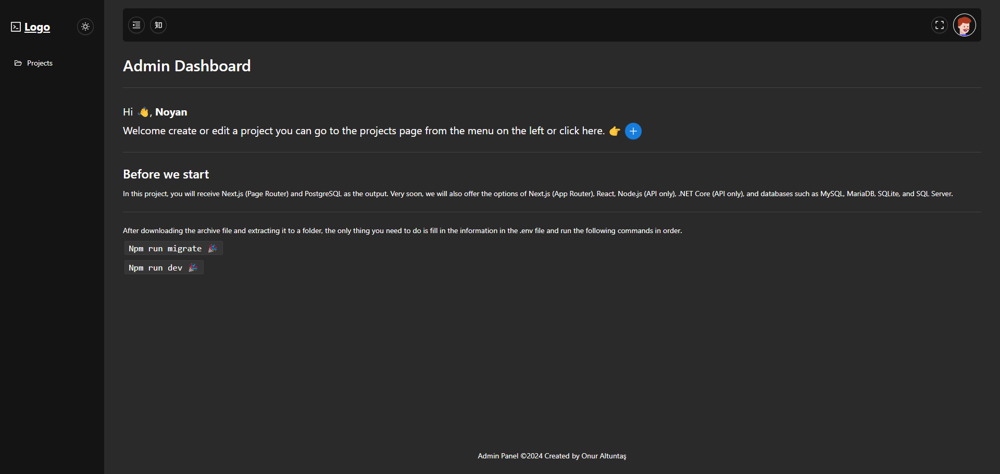
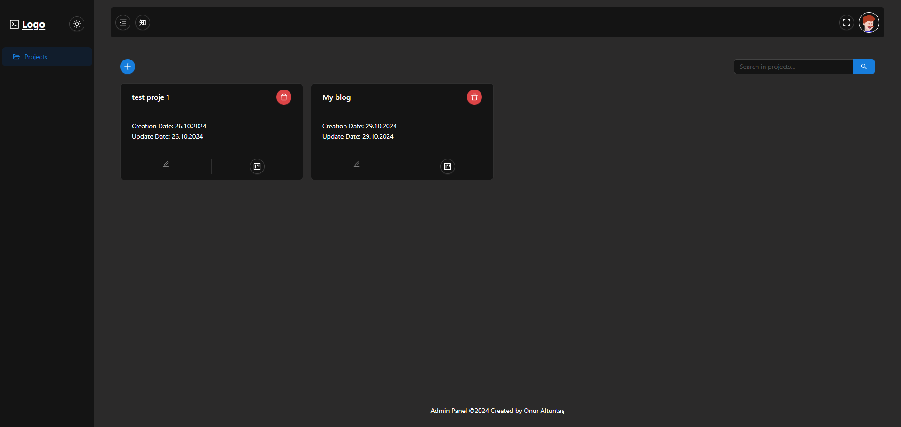
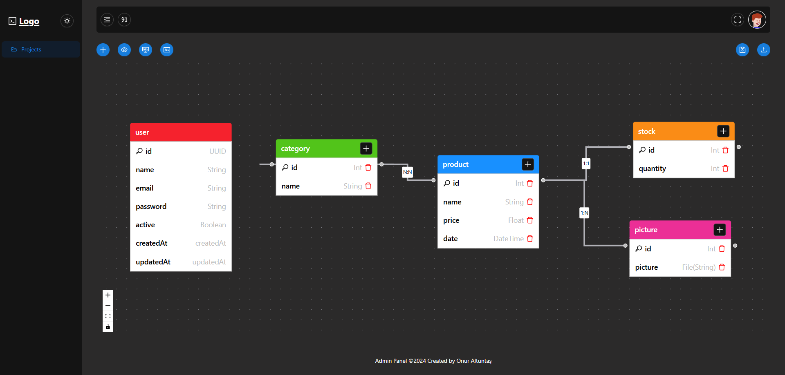
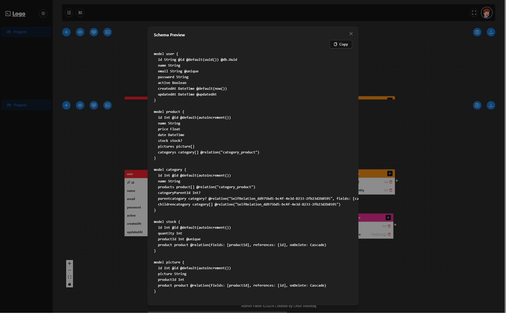
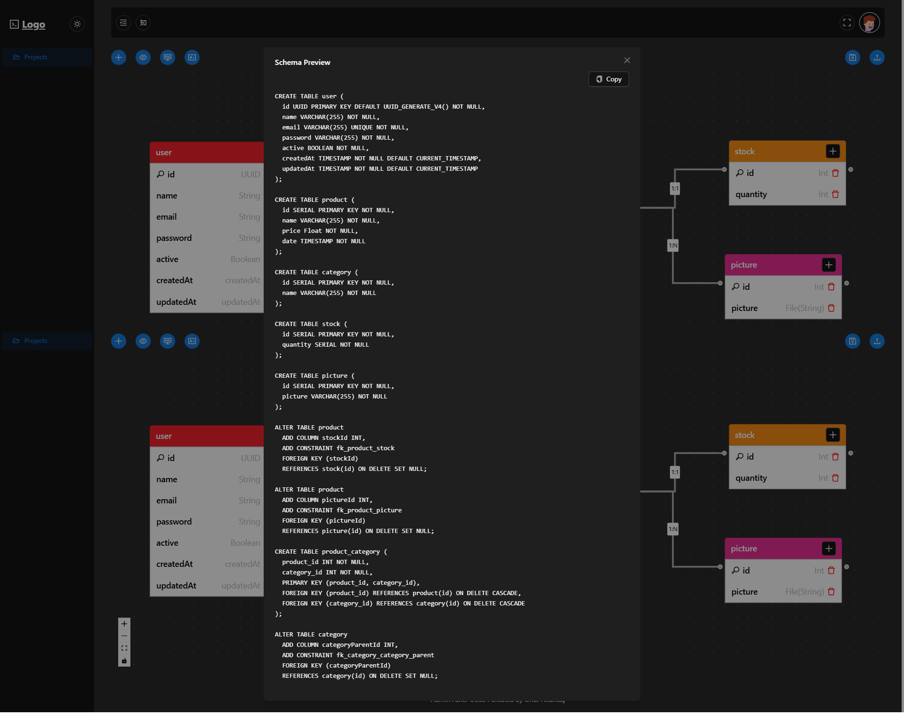
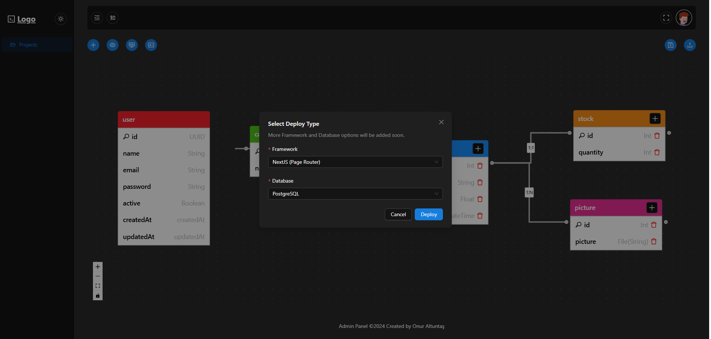
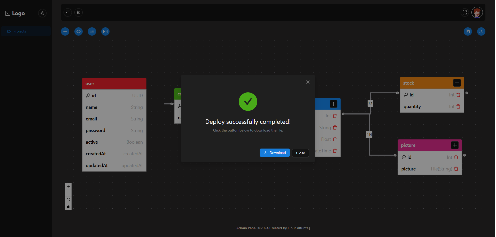

# ForgeCRUD

[ForgeCRUD](https://forgecrud.com/) is a database design and project creation platform developed for software developers and those looking to kickstart their projects quickly. Registered users can create database schemas and transform them into a Next.js-based project.

## Features

- **Database Design**: Create complex database structures using React Flow with 1:1, 1:N, N:N, and Self relationships.
- **Prisma Schema and SQL Output**: Preview and export your database design in **Prisma Schema** and **SQL** formats.
- **Next.js Project Output**: Automatically generate a Next.js project based on your database design.
- **Admin Panel**: Includes a ready-to-use admin panel, customizable with Ant Design.
- **Automatic API Route Creation**: Automatically generates API routes based on your database diagram.
- **Rate Limiting**: Provides rate limiting for API security.

## Usage Steps

1. [Sign up for ForgeCRUD](https://forgecrud.com/) and log in.
2. Create a **New Project** and use the React Flow interface to design your database structure.
3. Complete your database structure by adding relationships (1:1, 1:N, N:N, Self).
4. Once your design is complete, use the **Preview Buttons** to view your database schema in **Prisma Schema** and **SQL** formats.
5. When your project is ready, get the **Next.js Output** for a fully integrated project with a database and API.
6. Manage your data in an intuitive interface designed with Ant Design using the **Admin Panel**.

## Benefits of ForgeCRUD

- **Quick Start**: Start your projects on a web-based platform without needing a full setup.
- **Customizable**: Supports custom database structures and API routes tailored to your project needs.
- **Prisma Schema and SQL Support**: Preview and export your designs in both Prisma Schema and SQL formats.
- **Ease of Use**: A simple, user-friendly interface to easily create complex database structures.
- **Flexibility**: Choose to use it solely for database design or as a complete Next.js project output.

## Feedback and Contributions

To reach out to the ForgeCRUD team with suggestions or feedback, please contact us at [support email](mailto:altuntasonur99@gmail.com). We welcome contributions and suggestions to help improve the project.

## License

ForgeCRUD is a free service that helps users create projects with ease.

## Screenshots

Below are screenshots showcasing the features offered by the platform:

